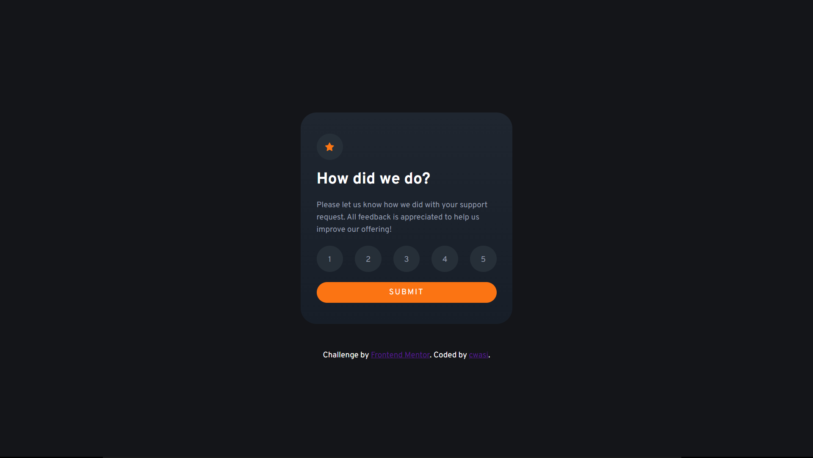

# Frontend Mentor - Interactive rating component solution

This is a solution to the [Interactive rating component challenge on Frontend Mentor](https://www.frontendmentor.io/challenges/interactive-rating-component-koxpeBUmI). Frontend Mentor challenges help you improve your coding skills by building realistic projects. 

## Table of contents

- [Overview](#overview)
  - [Screenshot](#screenshot)
  - [Links](#links)
- [My process](#my-process)
  - [Built with](#built-with)
- [Author](#author)

## Overview

### Screenshot

### Links

- Solution URL: [Source code](https://github.com/cwasi/FEM-stats-preview-card-component)
- Live Site URL: [Live site](https://cwasi-preview-card.netlify.app/)

## My process

### Built with

- Semantic HTML5 markup
- JavaScript
- CSS
- SCSS

## Author

- Frontend Mentor - [@cwasi](https://www.frontendmentor.io/profile/cwasi)
